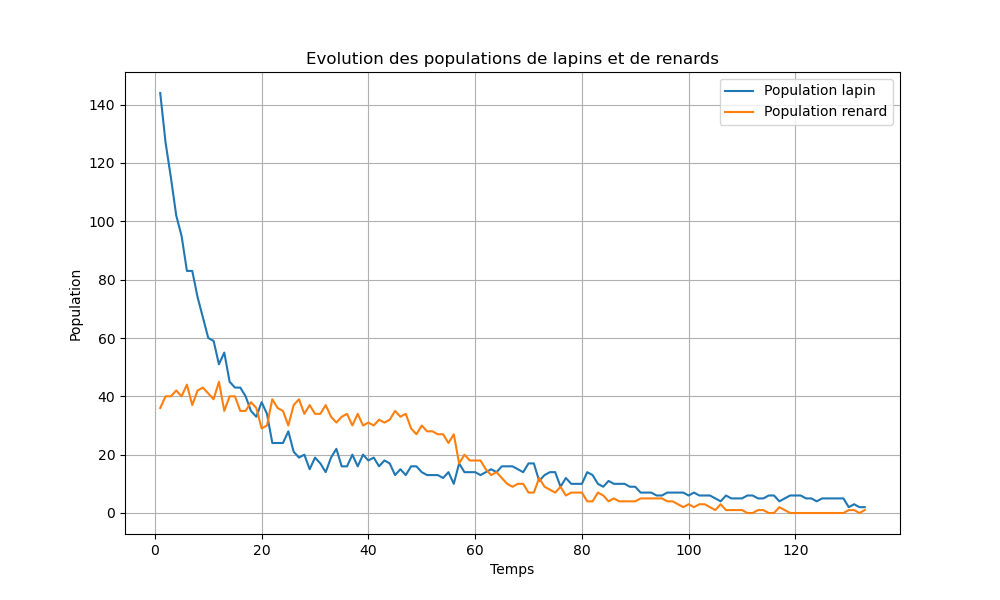

# Predateur-proie
Projet Programmation Modulaire
Projet de fin semestre réalisé par Quentin TALLOT et Nguyen Duc Nghia

# Résultats observés : différents cas

## Cas 1 : Le cas le plus fréquent

Si les renards parviennent a rester en groupe, ils ont des fortes chances de se reproduire, et domineront l'espace de simulation. Cependant, quand la population de lapins approchera celle des renards (c'est à dire que les renards auront mangé trop de lapins), ces derniers mourront de faim et de vieillesse; la simulation se termine donc avec une baisse des deux populations.

## Cas 2 : Les lapins gagnent

Si les renards sont trop éparpillés lors de la simulation, ils ont moins de chances de se rencontrer et de se reproduire, et donc meurent de vieillesse malgré l'abondance de nourriture.

On finit avec une population de lapins qui se reproduit plus rapidement qu'elle ne vieillit :

